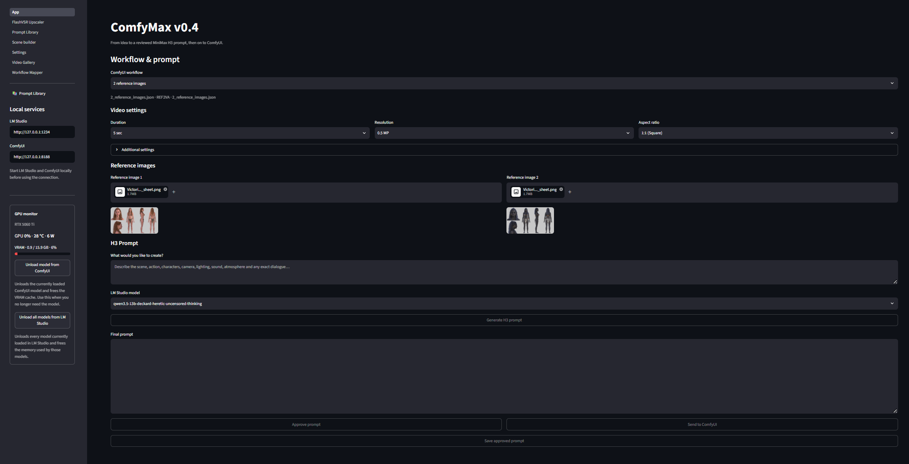

# ComfyMax v0.4

ComfyMax is a local Windows interface for preparing MiniMax H3 video prompts, reviewing them before rendering in ComfyUI, and browsing the results. It uses Streamlit for the interface and can use LM Studio to turn a scene idea into a structured prompt. You can also paste a finished prompt and skip LM Studio.



ComfyMax v0.4.0 adds the optional **FlashVSR v1.1 Tiny-Long 2x** upscaler, a local Prompt Library, improved LM Studio model handling, and fixes to the prompt-to-ComfyUI workflow.

> **Status:** v0.4.0 is the current tested public release.

## What's new in v0.4

- **Windows setup:** `setup_comfymax.bat` creates the ComfyMax environment and installs its Python dependencies.
- **Optional FlashVSR v1.1:** a separate installer, isolated environment, automatic compatible-model downloads, checksum verification, progress reporting and output in the configured ComfyUI folder.
- **LM Studio model management:** checks loaded instances before loading; reuses the requested model when possible; asks before unloading different or multiple loaded models. Cancel leaves them loaded. The manual **Unload all models from LM Studio** button remains available.
- **Local Prompt Library:** explicitly save approved prompts, search and filter them, reuse them for another render, and delete with confirmation.
- **Scene Builder:** compose characters, action, ordered dialogue turns, ending, camera and lighting before generating a final prompt.
- **Video Gallery:** browse output subfolders, play, search, filter, sort, download, open files in Explorer and delete with confirmation.
- **Workflow Mapper:** inspect an API workflow, review suggested mappings and install the workflow with its matching mapping.
- **Text-only and 1–9 reference-image workflow mappings**, prompt approval, mapped render controls and an NVIDIA GPU monitor.

## Install and start

### 1. Prepare your computer

Use Windows with **64-bit Python 3.11 and the Windows Python launcher** installed. The setup scripts use `py -3.11`; they do not install Python itself.

You also need:

- A working **ComfyUI** installation with the nodes and models required by your chosen workflow.
- **LM Studio** with a downloaded model and its local API server enabled if you want prompt generation. Use a vision-capable model when asking it to interpret reference images.
- **Git for Windows** if you clone the project or use its Git updater. An extracted source ZIP can be used without Git.
- An NVIDIA GPU and working drivers for this FlashVSR integration. Its pinned environment uses **PyTorch 2.10.0 + CUDA 13.0**. The GPU monitor uses `nvidia-smi`.

ComfyMax setup installs the interface dependencies. It does not install ComfyUI, LM Studio, their models or custom nodes, and **does not call the FlashVSR installer**.

### 2. Get this version of ComfyMax

Extract the complete project archive into a writable folder, or clone the repository and select the branch/release you intend to use. Keep the project folders together; copying only `App.py` or the installer is insufficient.

The public repository is [danielveresbelgium/ComfyMax](https://github.com/danielveresbelgium/ComfyMax).

### 3. Run the interface setup

Double-click **setup_comfymax.bat** in the main ComfyMax folder, or run from PowerShell in that folder:

```powershell
.\setup_comfymax.bat
```

It creates `.venv` when absent and installs `requirements.txt` into it. Wait for the success message. If setup fails, fix the reported error before continuing. Windows treats `Setup_ComfyMax.bat` and `setup_comfymax.bat` as the same filename.

### 4. Test the example directly in ComfyUI

Open the supplied workflow from `workflow_example/` in ComfyUI. Install any missing nodes, select the required models and complete a render there first. This establishes that the rendering workflow works before adding the ComfyMax interface.

### 5. Start the services and interface

Start ComfyUI. Start the LM Studio local server if using prompt generation. The configuration defaults are:

| Service | Address |
| --- | --- |
| ComfyUI | `http://127.0.0.1:8188` |
| LM Studio | `http://127.0.0.1:1234` |
| ComfyMax interface | `http://localhost:8501` |

Run **Start_ComfyMax.bat**. It starts Streamlit using `.venv` and calls the interface setup if that environment is missing. Its startup port warnings check the default ports above; use Settings for your actual service addresses.

### 6. Configure ComfyMax

Open **Settings** and save your service URLs, workflow model selections and existing **ComfyUI output folder**. Model choices are read from ComfyUI, so it must be running to refresh those lists.

For example, if your actual output folder is `D:\ComfyUI\ComfyUI\output`, select that folder and use **Test output folder**. Use your own installation's path. This setting supplies the Gallery and the FlashVSR output location.

The older [INSTALLATION.md](INSTALLATION.md) provides additional background. For the explicit Python requirement, setup commands and FlashVSR model layout in v0.4.0, follow this README.

## Make your first video

1. Select a workflow. Upload all reference images it requires, in their mapped picture order.
2. Enter a scene idea, optionally prepared with **Scene Builder**.
3. Select an LM Studio model and generate the H3 prompt, or paste your finished text into **Final prompt**.
4. Review and edit the final text, then approve it. Editing revokes approval.
5. Set the controls exposed by the workflow mapping and send the approved prompt to ComfyUI.
6. Review the result and browse saved videos in **Video Gallery**.

Generating a prompt does not start a render. Render controls depend on the mapping and can include duration, resolution, aspect ratio, steps and seed. Render seed `0` requests a random seed; the actual seed is retained in the result metadata.

The repository includes mappings for text-only generation and one through nine reference images. Mapping availability does not establish successful testing of every image count or workflow. Keep `<Picture N>` references aligned with the selected workflow's image order.

### LM Studio and GPU memory

Before loading a model, ComfyMax queries LM Studio for loaded instances. If a different model, or several models, is loaded, approve unloading them before the new load can proceed. Declining cancels the requested load. A failure to establish a safe loaded-model state blocks loading.

The prompt-generation flow unloads its LM Studio model afterward. ComfyUI models stay loaded after rendering for repeated renders; use **Unload model from ComfyUI** when finished. The sidebar also provides **Unload all models from LM Studio** and GPU utilization, VRAM, temperature and power readings when available.

### Save and reuse prompts

After approval, choose **Save approved prompt**. Approval by itself does not save it. **Prompt Library** supports searching and filtering saved entries and reusing their text. Reuse does not start generation or rendering: check the workflow, settings and images, then approve again.

Entries are stored locally in `data/prompt_library.sqlite3`, with exact prompt text, save time and available model/workflow metadata. Stop ComfyMax before copying that database for backup. See [Prompt Library details](docs/PROMPT_LIBRARY.md).

## Optional: install FlashVSR v1.1

Run **install_FlashVSR.bat** from the complete ComfyMax folder:

```powershell
.\install_FlashVSR.bat
```

The script checks for the required engine files and 64-bit Python 3.11, then delegates to the existing `engines/flashvsr/installer.py`. That installer:

1. Creates `engines/flashvsr/env_venv` if needed.
2. Installs the pinned engine dependencies from `requirements.lock.txt`.
3. Downloads missing or invalid compatible v1.1 models, reusing files that pass SHA-256 verification.
4. Checks dependencies, runtime imports, CUDA availability, model hashes and FFmpeg.

The interface also has an **Install / repair FlashVSR** button. Both installation routes use the same Python installer. The four compatible weights total about **3.51 GB**, with additional disk space needed for the environment and temporary downloads.

### Model source and exact location

The [official FlashVSR v1.1 repository](https://huggingface.co/JunhaoZhuang/FlashVSR-v1.1/tree/main) lists an Apache-2.0 license. However, its upstream checkpoints are **not drop-in replacements** for the files this ComfyMax runtime loads.

This integration uses the [Wan2GP-compatible BF16 conversions from DeepBeepMeep](https://huggingface.co/DeepBeepMeep/Wan2.1/tree/main/FlashVSR), as specified in `engines/flashvsr/models.json`. The automatic downloader retains that source. It is a separate repository from the official FlashVSR author repository.

The worker requires all four of these exact filenames:

```text
ComfyMax/
└── engines/
    └── flashvsr/
        └── models/
            ├── FlashVSR_v1.1_transformer_bf16.safetensors
            ├── FlashVSR_v1.1_lq_proj_bf16.safetensors
            ├── FlashVSR_v1.1_posi_prompt_bf16.safetensors
            └── FlashVSR_v1.1_tcdecoder_bf16.safetensors
```

For an installation at `D:\ComfyMax-EN`, for example, the exact folder is `D:\ComfyMax-EN\engines\flashvsr\models`.

Do not rename official `.ckpt` or `.pth` files to these names: the format, contents and recorded hashes differ, and the runtime explicitly loads a separate prompt-context safetensors file. This Tiny-Long worker sets `vae=None` and does not require a separate Wan VAE download. Direct downloading from the author's repository would require a separately verified conversion or runtime change.

For manual installation, obtain those four files from the compatible-model source above and place them directly in the model folder. Run the installer to complete dependency setup and verify them. The manifest records each download URL and expected SHA-256; a checksum mismatch fails instead of accepting the file.

To reuse models from a previous standalone installation:

```powershell
.\install_FlashVSR.bat --models-from "D:\ComfyMax-FlashVSR\models"
```

Replace the example source folder with your own. The files are copied and verified; dependency installation still runs. To check an already installed environment without installing or downloading:

```powershell
.\install_FlashVSR.bat --check
```

### Upscale a video

Save the existing ComfyUI output folder in **Settings**, then open **FlashVSR Upscaler**, upload a video and start upscaling. Free GPU memory with the provided unload buttons when needed.

The preserved preset is **Tiny-Long, 2x scale, MMGP profile 4, TCDecoder tiles 512, top-k 0 (automatic), seed 0, Two Pass off**. These are the worker's fixed settings; its seed is separate from the ComfyUI random-seed control.

Results are saved to:

```text
<ComfyUI output folder saved in Settings>\videos\upscaled
```

For the output example above, this is `D:\ComfyUI\ComfyUI\output\videos\upscaled`. Filenames use a `_flashvsr_2x.mp4` suffix, with numeric suffixes for collisions. The Gallery scans subfolders and can find these results. The worker copies source audio when possible and falls back to AAC when needed for MP4.

### Validation scope

The repository's [FlashVSR validation record](docs/FLASHVSR_VALIDATION.md) documents a real integrated-client test on an RTX 5060 Ti: a 124-frame, approximately 5.17-second clip was upscaled from 640×640 to 1280×1280 at 24 fps with audio. It also records four verified local model hashes and a real download of the small prompt model.

That record does not establish a full fresh multi-gigabyte download test, browser-upload end-to-end testing or long-video validation. Start with a short clip; this worker decodes the input into memory. No general minimum VRAM or long-video performance guarantee is established by the repository.

## Add workflows and manage files

Export your working ComfyUI graph in **API Format**, open **Workflow Mapper**, upload it and review the suggested controls and compatibility warnings. Install it through the page after resolving validation errors. The API workflow in `workflows/` and its mapping in `config/workflow_mappings/` must have the same filename.

Scene Builder's question configuration lives in `config/scene_questions.json`. Video Gallery reads the saved output path recursively and supports filename/subfolder search, date filters, sorting and two to five columns. Deleting a video requires confirmation.

| Location | Purpose |
| --- | --- |
| `App.py`, `pages/`, `modules/` | Interface and application code |
| `.venv/` | ComfyMax interface environment |
| `config/app.json` | Service configuration |
| `config/settings.json` | Saved settings, including output folder |
| `config/workflow_mappings/`, `workflows/` | Paired mappings and API workflows |
| `workflow_example/` | Examples to test directly in ComfyUI |
| `data/prompt_library.sqlite3` | Saved prompt library |
| `engines/flashvsr/env_venv/` | Separate FlashVSR environment |
| `engines/flashvsr/models/` | Four compatible v1.1 model files |

## Update and troubleshoot

For a Git installation, run **Update_ComfyMax.bat**. It checks the current branch against `origin`, stops for modified tracked files and updates the UI dependencies when `.venv` is available. Review and commit intentional local changes before updating. Back up your settings, custom workflows and prompt database. FlashVSR installation/repair remains a separate action.

| Problem | What to check |
| --- | --- |
| Python launcher or Python 3.11 missing | Install 64-bit Python 3.11 with the launcher; retry setup. |
| ComfyMax cannot render | Run the example directly in ComfyUI; resolve missing nodes/models first. |
| Prompt cannot be sent | Supply required images, nonempty final text, approval and a matching mapping. |
| LM Studio model loading is blocked | Review loaded instances and the unload confirmation; check the local server connection. |
| Gallery is empty | Save/test the actual output folder, clear filters and refresh. |
| FlashVSR download or checksum fails | Check the reported network/file error, disk space and model source; rerun installation. Invalid partial downloads are not accepted as models. |
| Installer reports another setup running | Wait for that setup. Only if it was forcibly interrupted and no setup is running, remove `engines/flashvsr/.setup.lock` and retry. |
| FlashVSR CUDA/import check fails | Review the pinned environment error and GPU/driver compatibility; run `install_FlashVSR.bat --check` after repair. |
| GPU monitor unavailable | Check that `nvidia-smi` works. |
| Missing detailed video metadata | Make `ffprobe` available. FlashVSR itself can use PATH FFmpeg, an engine-local binary or bundled imageio-ffmpeg. |

## Credits and license information

ComfyMax integrates ComfyUI, LM Studio and MiniMax H3 workflows. FlashVSR runtime portions come from [Wan2GP](https://github.com/deepbeepmeep/Wan2GP); retain their existing notices. Official model information and compatible model downloads are linked above.

The current root [LICENSE](LICENSE) identifies MIT and credits Daniel Veres, but contains only the heading and copyright line. The full license terms should be supplied before distributing a release. Third-party components and model sources have their own terms.

